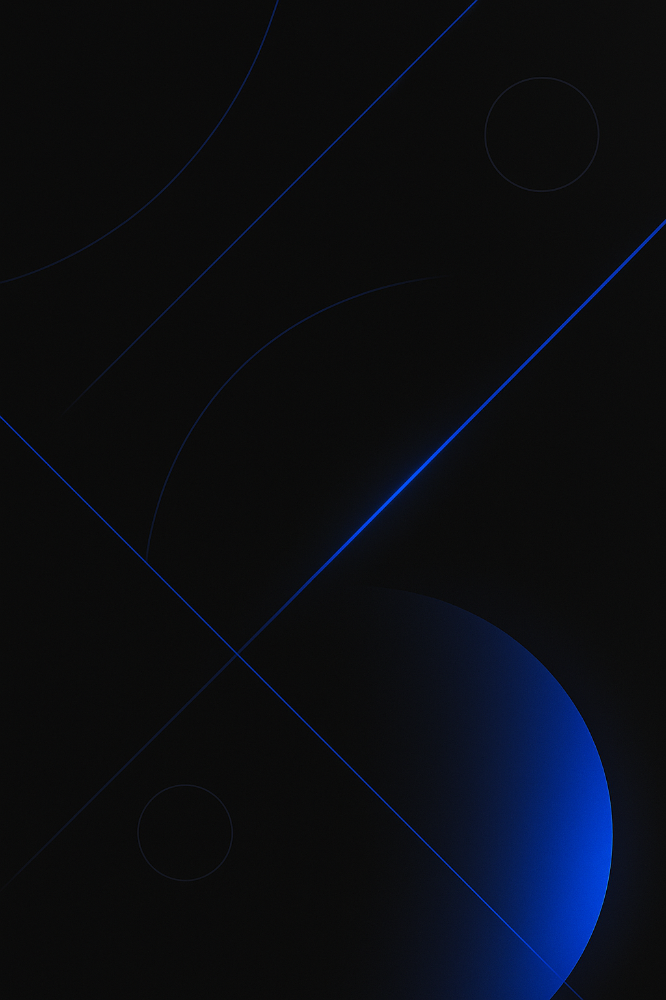

<!-- Portada o header de tu perfil -->
<p align="center">
  <!-- Imagen de cabecera en negro y azul -->
  
</p>

<!-- Sección "Sobre mí" con formato YAML para un aspecto limpio y profesional -->
```yaml
nombre: "Mathias Arias"
profesión: "Fullstack Developer"
ubicación: "Asunción, Paraguay"
resumen: Desarrollador Full-Stack JavaScript/TypeScript orientado a producto, con experiencia construyendo
aplicaciones web modernas de principio a fin: frontend en React/Next.js, backend en Node.js y bases de datos
SQL/NoSQL.
Acostumbrado a trabajar con arquitecturas modulares, autenticación, paneles de administración, paneles de
clientes, dashboards y consumo/diseño de APIs REST. Me gusta tomar ideas desde cero, diseñar la arquitectura,
implementarla y desplegarla en producción, manteniendo buenas prácticas (clean code, componentes
reutilizables, control de versiones y CI/CD)..
```

### Habilidades y tecnologías

<p align="left">
  <!-- Iconos de tecnologías (puedes añadir o quitar según tus habilidades) -->
  
  
  
  
  <!-- Añade más iconos siguiendo este formato -->
</p>

### Contacto

<p align="left">
  <!-- Sustituye los enlaces por los de tus propias cuentas -->
  <a href="https://www.linkedin.com/in/mathias-arias-/" target="_blank">
    
  </a>
  <a href="mailto:mathi.fer069@gmail.com">
    
  </a>
  <!-- Añade más iconos de redes o medios de contacto si lo consideras necesario -->
</p>

---

<details>
<summary>📊 Estadísticas de GitHub (opcional)</summary>

<p align="left">
  
</p>

</details>
